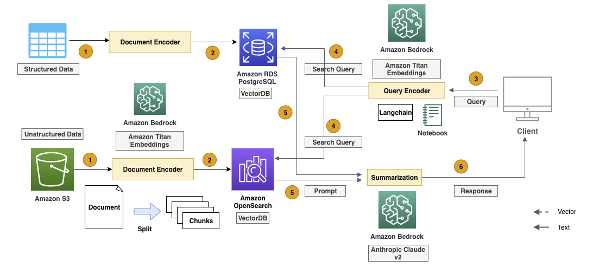

# LLM powered hybrid Vector Search with Amazon Aurora PostgreSQL, Amazon OpenSearch, Langchain and Bedrock 

This repository demonstrates how to perform hybrid vector search by combining structured data from Amazon Aurora PostgreSQL, unstructured data from Amazon OpenSearch, and Langchain's EnsembleRetriever. It illustrates how to combine and re-rank the search results from both sources, and then synthesize the final output using Bedrock LLM.

## Prerequisites 
Before running the notebook, make sure you have the following: 
1. Make sure your Amazon Aurora PostgreSQL Database is setup with pgvector extension.
2. Make sure you Amazon OpenSearch cluster is up and running
3. AWS Secrets Manager has following keys for Amazon OpenSearch:
     opensearch_endpoint,
     opensearch_user,
     opensearch_password
4. AWS Secrets Manager also has following keys for Aurora PostgreSQL:
     host,
     port,
     username,
     password
5. Amazon Bedrock access has been enabled for Anthropic model in your account and region
6. AWS SageMaker Notebook instance has access to AWS Secrets Manager, Amazon Aurora PostgreSQL, Amazon OpenSearch and Amazon Bedrock.

# Solution

## Security

See [CONTRIBUTING](CONTRIBUTING.md#security-issue-notifications) for more information.

## License

This library is licensed under the MIT-0 License. See the LICENSE file.
